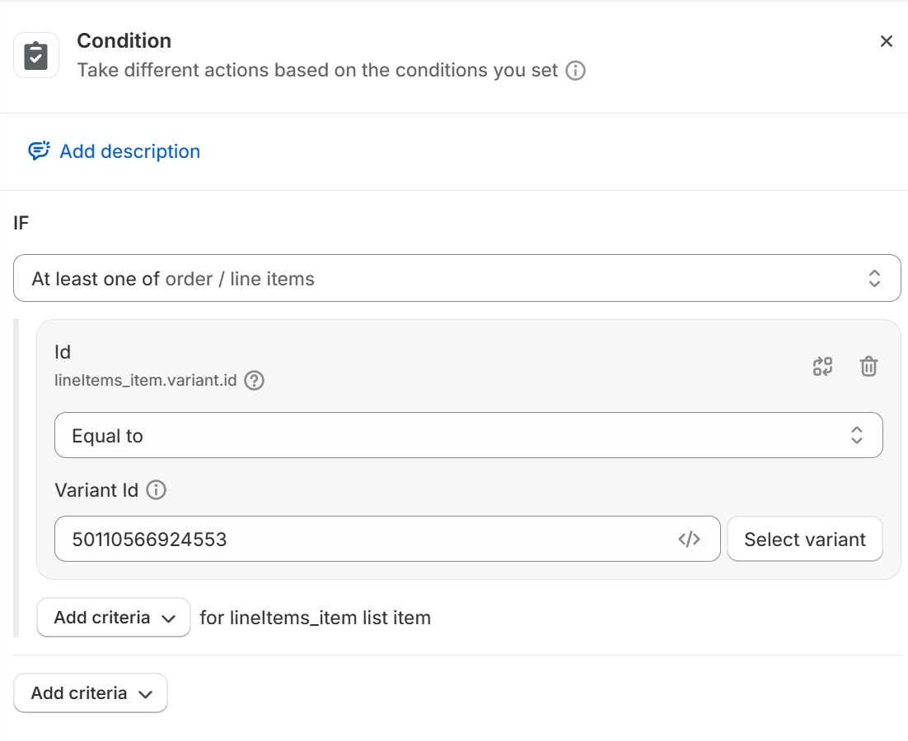
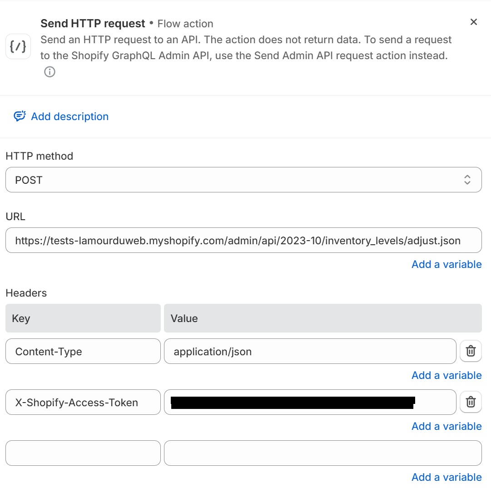
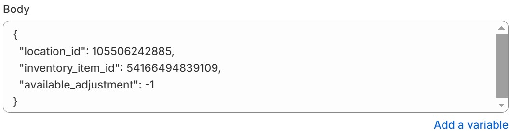

# Personnalisation d'un thème Shopify (Dawn) - Gestion des Promotions et Réductions

## 🔗 Lien du site

**URL :** [Accéder à la boutique](https://tests-lamourduweb.myshopify.com/)

**Mot de passe :** `laullu`

## 📌 Introduction

Ce projet vise à tester mes compétences en **développement Shopify** à travers **quatre exercices pratiques**. L'objectif est d'améliorer et d'automatiser certaines fonctionnalités clés d'une boutique Shopify en utilisant des **bonnes pratiques de développement**, de **gestion de version** et d'optimisation de l'affichage des promotions et réductions.

## 🛠️ Technologies et outils utilisés

- **Shopify Liquid** : Personnalisation des templates du thème.
- **JavaScript (AJAX, Fetch API)** : Gestion dynamique du panier et mises à jour en temps réel.
- **Shopify Flow** : Automatisation de la gestion de stock.
- **Shopify CLI** : Développement et prévisualisation du thème en local.
- **Git & GitHub** : Gestion de version et collaboration.
- **Métafields Shopify** : Personnalisation du badge de promotions.

## Exercice 1 : Personnalisation du cart drawer

### 🎯 Objectif

Afficher **des messages promotionnels dynamiques** et **ajouter un produit cadeau automatiquement** lorsque le panier atteint un certain montant.

**Seuils d'achat** :
- **Livraison gratuite** à partir de **50 €**  
- **Cadeau offert** à partir de **100 €**  

Une fois ces seuils atteints, un **message de confirmation** est affiché, et le produit cadeau est ajouté **sans rechargement de la page** via **AJAX**.

## 🎥 Démo
[](https://youtu.be/IOKT8MbMwj8)  
🔗 [Lien direct vers la vidéo](https://youtu.be/IOKT8MbMwj8)

### 📝 Implémentation

**Affichage dynamique des messages promotionnels**  
   - Récupération du **total du panier** via la variable `cart.total_price` (valeur en centimes).  
   - Calcul de la différence entre le montant actuel et les seuils promotionnels (50€ et 100€).  
   - Affichage des messages en **temps réel**, mis à jour à chaque modification du panier.  

**Ajout automatique du produit cadeau**  
   - Surveillance du total du panier avec l'**API AJAX Shopify** via `/cart.js`, `/cart/add.js` et `/cart/change.js`.  
   - Vérification que le **produit cadeau** n'est pas déjà dans le panier.  
   - Ajout automatique du cadeau **lorsque le seuil de 100 € est atteint**.  
   - Affichage d'un **message de confirmation** dynamique.  

**Snippet spécifique `cart-promotions.liquid`**  
   - Utilisé pour gérer **l'affichage des promotions** dans le cart drawer.  
   - Vérifie si la livraison gratuite ou le cadeau offert doit être affiché.  

### 📂 Fichiers modifiés

- `sections/cart-drawer.liquid` – Structure du cart drawer et inclusion du snippet  
- `snippets/cart-promotions.liquid` – Gestion des messages promotionnels  
- `assets/cart.js` – Ajout du produit cadeau via **AJAX**  

### 💻 Code AJAX utilisé pour ajouter le produit cadeau

```js
/**
 * =========================================================
 * GESTION AUTOMATIQUE DU PRODUIT CADEAU
 * =========================================================
 *
 * Fonctionnalité :
 * - Ajoute un cadeau automatiquement au panier lorsque le seuil de 100€ est atteint.
 * - Supprime le cadeau si le montant redescend en dessous du seuil.
 * - Met à jour le cart drawer en temps réel sans rechargement de page.
 *
 * Technologies utilisées :
 * - Shopify AJAX API (/cart.js, /cart/add.js, /cart/change.js)
 * - JavaScript Vanilla
 *
 * Bonnes pratiques :
 * - Utilisation d'un débounce pour éviter les requêtes excessives.
 * - Vérification et mise à jour fluide et optimisée du panier.
 * - Utilisation d'événements pour une mise à jour réactive du cart drawer.
 */

document.addEventListener('DOMContentLoaded', function () {
  /**
   * ID du produit cadeau
   * @constant {number}
   */
  const GIFT_PRODUCT_ID = 50110566924553;

  /**
   * Seuil en euros pour ajouter le cadeau.
   * @constant {number}
   */
  const GIFT_THRESHOLD = 100;

  /**
   * Variable pour éviter les requêtes multiples simultanées.
   * @type {boolean}
   */
  let isUpdatingCart = false;

  /**
   * Fonction de debounce pour limiter la fréquence des appels AJAX.
   * @param {Function} func - La fonction à exécuter après le délai.
   * @param {number} delay - Temps d'attente avant l'exécution (en ms).
   * @returns {Function} - Fonction debouncée.
   */
  function debounce(func, delay) {
    let timeout;
    return function (...args) {
      clearTimeout(timeout);
      timeout = setTimeout(() => func.apply(this, args), delay);
    };
  }

  /**
   * Met à jour le cart drawer sans recharger la page.
   * Vérifie si la méthode onCartUpdate est disponible et l'exécute.
   * Sinon, déclenche un événement global cart:updated.
   */
  function updateCartDrawer() {
    const drawerItems = document.querySelector('cart-drawer-items');
    if (drawerItems && typeof drawerItems.onCartUpdate === 'function') {
      drawerItems.onCartUpdate();
    } else {
      document.dispatchEvent(new Event('cart:updated'));
    }
  }

  /**
   * Gère l'ajout et la suppression automatique du cadeau.
   * - Ajoute le cadeau si le total atteint le seuil et qu'il n'est pas déjà dans le panier.
   * - Supprime le cadeau si le total redescend sous le seuil.
   */
  function updateGiftProduct() {
    if (isUpdatingCart) return; // Empêche les requêtes multiples simultanées
    isUpdatingCart = true;

    fetch('/cart.js')
      .then((response) => response.json())
      .then((cart) => {
        const total = cart.total_price / 100; // Convertit en euros
        const giftItem = cart.items.find((item) => item.variant_id === GIFT_PRODUCT_ID);

        // Ajout du cadeau si seuil atteint et cadeau absent
        if (total >= GIFT_THRESHOLD && !giftItem) {
          fetch('/cart/add.js', {
            method: 'POST',
            headers: { 'Content-Type': 'application/json' },
            body: JSON.stringify({ id: GIFT_PRODUCT_ID, quantity: 1 }),
          })
            .then((response) => {
              if (!response.ok) throw new Error("Erreur lors de l'ajout du cadeau");
              return response.json();
            })
            .then(() => {
              setTimeout(updateCartDrawer, 1000); // Met à jour le cart drawer après 1s
            })
            .catch((error) => console.error("Erreur lors de l'ajout du cadeau:", error))
            .finally(() => {
              isUpdatingCart = false;
            });
        }

        // Suppression du cadeau si seuil non atteint et cadeau présent
        else if (total < GIFT_THRESHOLD && giftItem) {
          if (!giftItem.key) {
            console.error('Clé `key` introuvable pour suppression.');
            isUpdatingCart = false;
            return;
          }

          fetch('/cart/change.js', {
            method: 'POST',
            headers: { 'Content-Type': 'application/json' },
            body: JSON.stringify({ id: giftItem.key, quantity: 0 }), // Utilisation de `key`
          })
            .then((response) => {
              if (!response.ok) {
                throw new Error(`Erreur suppression cadeau (HTTP ${response.status})`);
              }
              return response.json();
            })
            .then(() => {
              setTimeout(updateCartDrawer, 1000);
            })
            .catch((error) => console.error('Erreur lors de la suppression du cadeau:', error))
            .finally(() => {
              isUpdatingCart = false;
            });
        } else {
          isUpdatingCart = false;
        }
      })
      .catch((error) => console.error('Erreur lors de la récupération du panier:', error))
      .finally(() => {
        setTimeout(() => {
          isUpdatingCart = false; // Réinitialisation après 1 seconde pour éviter le spam
        }, 1000);
      });
  }

  /**
   * Initialise et écoute les événements pour la mise à jour du panier.
   * - `cart:updated` : Déclenché lorsqu'un changement est détecté dans le panier.
   * - `Shopify AJAX API` : Surveille les ajouts et modifications du panier.
   * - Utilisation d'un debounce pour éviter les appels API en rafale.
   */
  const debouncedUpdateGiftProduct = debounce(updateGiftProduct, 500);

  updateGiftProduct(); // Vérification au chargement de la page

  document.addEventListener('cart:updated', debouncedUpdateGiftProduct);

  // Écoute les mises à jour du panier via l'API Shopify
  if (typeof PUB_SUB_EVENTS !== 'undefined' && typeof subscribe === 'function') {
    subscribe(PUB_SUB_EVENTS.cartUpdate, debouncedUpdateGiftProduct);
  }

  // Détecte les ajouts de produits au panier
  document.querySelectorAll('form[action^="/cart/add"]').forEach((form) => {
    form.addEventListener('submit', function () {
      setTimeout(debouncedUpdateGiftProduct, 1500); // Délai pour éviter le spam
    });
  });

  // Détecte les changements de quantité et met à jour dynamiquement
  document.addEventListener('change', function (e) {
    if (e.target.matches('input[data-quantity-variant-id]')) {
      debouncedUpdateGiftProduct();
    }
  });
});
```
- La réponse JSON met à jour l'interface en **temps réel**. 

### Instructions de test  

**URL :** [Accéder à la boutique](https://tests-lamourduweb.myshopify.com/)

**Mot de passe :** `laullu`

#### Étapes de test :

1. **Ajouter des produits au panier** et observer les messages dynamiques.  
2. **Vérifier le seuil de 50€** :
   - Un message indique combien il reste avant la livraison gratuite.  
   - Une fois le seuil atteint, la livraison devient **gratuite** et le message change.  
3. **Vérifier le seuil de 100€** :
   - Un message indique combien il reste avant le cadeau offert.  
   - Une fois atteint, le **produit cadeau est ajouté automatiquement** au panier.  
   - Un **message de confirmation** apparaît.  
4. **Tester la suppression du cadeau** :
   - Retirer un produit du panier et vérifier que le **cadeau est retiré** si le montant passe sous 100€.  

## Exercice 2 : Automatisation de la gestion des stocks avec Shopify Flow

### 🎯 Objectif

Automatiser **la gestion du stock** du produit cadeau en utilisant Shopify Flow.

## Demo
[](https://youtu.be/lZQna_F9h8s)
https://youtu.be/lZQna_F9h8s

### 📝 Implémentation

**Workflow**


1. **Déclencheur** : Quand une commande est passée.
   
3. **Condition** : Vérifier si la commande contient **le produit cadeau**.
   
5. **Action** : Déduire automatiquement le stock du produit cadeau.
   
   

### Instructions de test

1. **Passer une commande** contenant le produit cadeau.
2. Vérifier dans **Shopify Admin** que **le stock a été mis à jour automatiquement**.

## Exercice 3 : Gestion de version avec Shopify CLI et GitHub

### 🎯 Objectif

Mettre en place **une gestion de version propre** et un **workflow efficace**.

### 📝 Implémentation

1. **Utilisation de Shopify CLI** :
   - Clonage du thème **Dawn** et configuration de l'environnement local.
   - Utilisation de :
     ```sh
     shopify theme dev
     ```
     pour tester en local.
   
2. **Gestion de version avec Git** :
   - Création de **branches dédiées** (`feature/`, `fix/`, `docs/`...).
   - **Messages de commit clairs et détaillés**.
   - Documentation centralisée dans `README.md`.

### Instructions de test

1. **Cloner le dépôt** :
   ```sh
   git clone https://github.com/VincentWings/tests-lamourduweb.git
   cd tests-lamourduweb
   ```
2. **Lancer l'environnement Shopify** :
   ```sh
   shopify theme dev
   ```

## Exercice 4 : Application d'une réduction automatique de 10%

### 🎯 Objectif

Appliquer **automatiquement une réduction de 10 %** aux produits d'une collection spécifique et afficher **les prix barrés**.

## Demo
[](https://youtu.be/Z2MsRnF5OSU)
[https://youtu.be/lZQna_F9h8s](https://youtu.be/Z2MsRnF5OSU)

### 📝 Implémentation

1. **Détection des produits concernés** :
   - Vérification si un produit appartient à la collection **`Promotions`**.
   - Application automatique d'une réduction de **10 %**.

2. **Affichage des prix barrés** :
   - Affichage du **prix original barré** et du **prix remisé**.
   - Mises à jour **dynamiques** lors de l'ajout au panier.

3. **Utilisation des Métafields Shopify** :
   - Ajout d'un champ personnalisé `custom.titre_promotion` dans les collections.
   - Permet d'afficher **un nom de promotion personnalisé**.

### Fichiers modifiés

- `snippets/price.liquid`
- `snippets/cart-product.liquid`

### Instructions de test

1. Vérifier que **les produits de la collection `Promotions`** ont bien leur **prix barré** et le bon libellé de promotion.
2. Ajouter un produit au panier et s'assurer que **la réduction est bien appliquée**.

## 📜 Conclusion

Ce projet m'a permis de travailler sur plusieurs aspects essentiels du **développement Shopify** :

- **Personnalisation du front-end** : Ajout de promotions dynamiques et gestion des prix barrés.  
- **Automatisation de la gestion de stocks** : Gestion du stock du produit cadeau avec **Shopify Flow**.  
- **Gestion de version** : Utilisation de **Git**, **GitHub** et **Shopify CLI** pour un workflow structuré.
